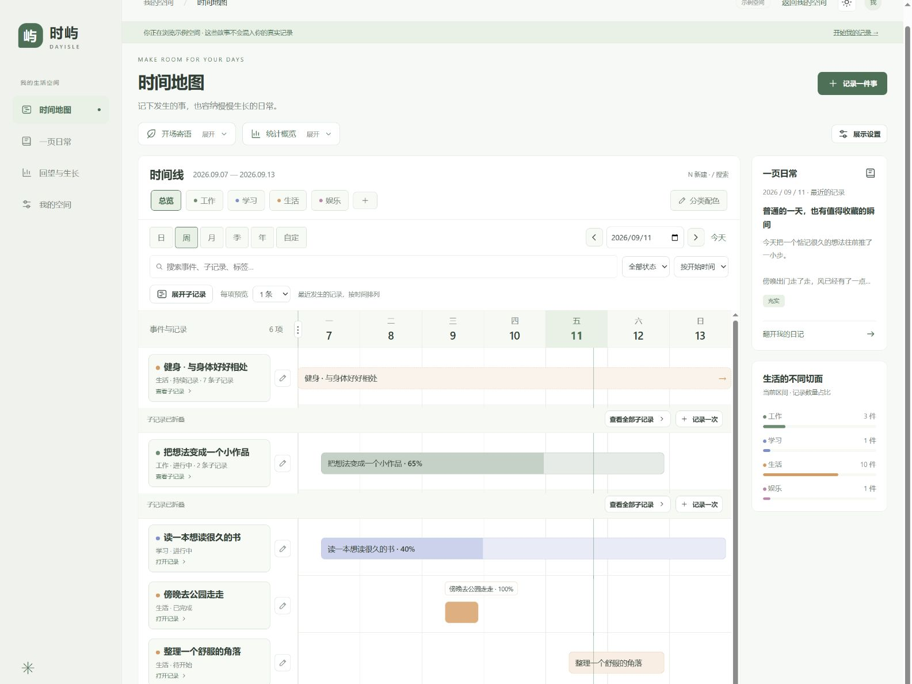
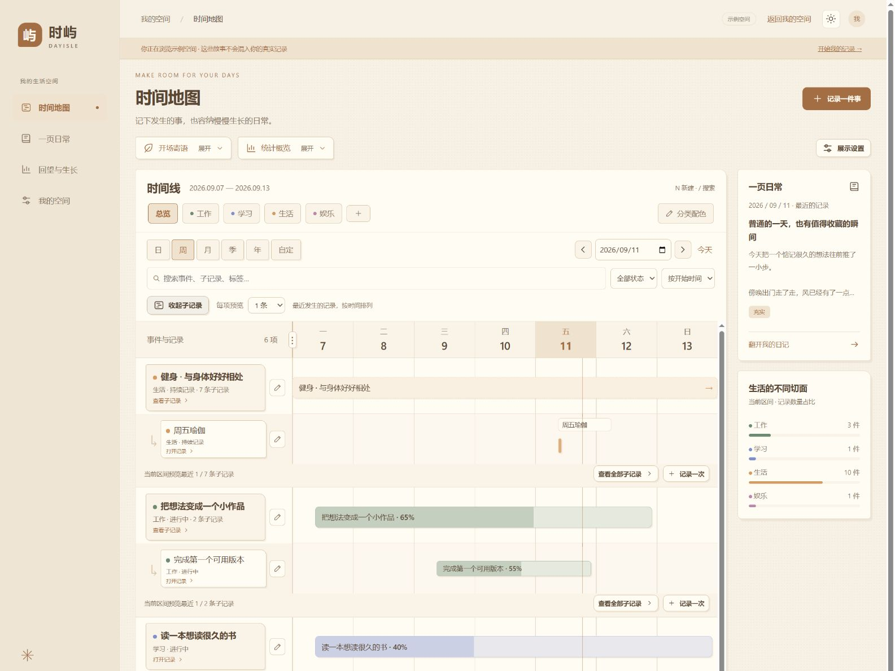
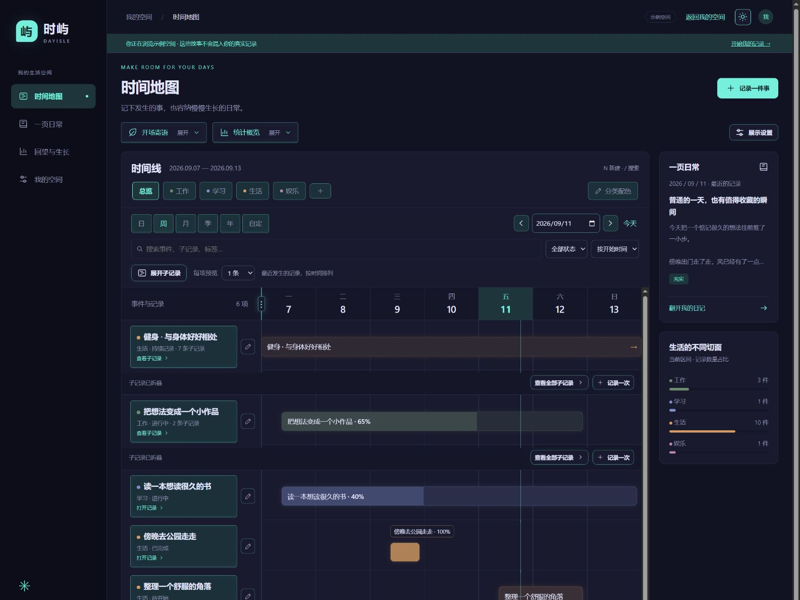
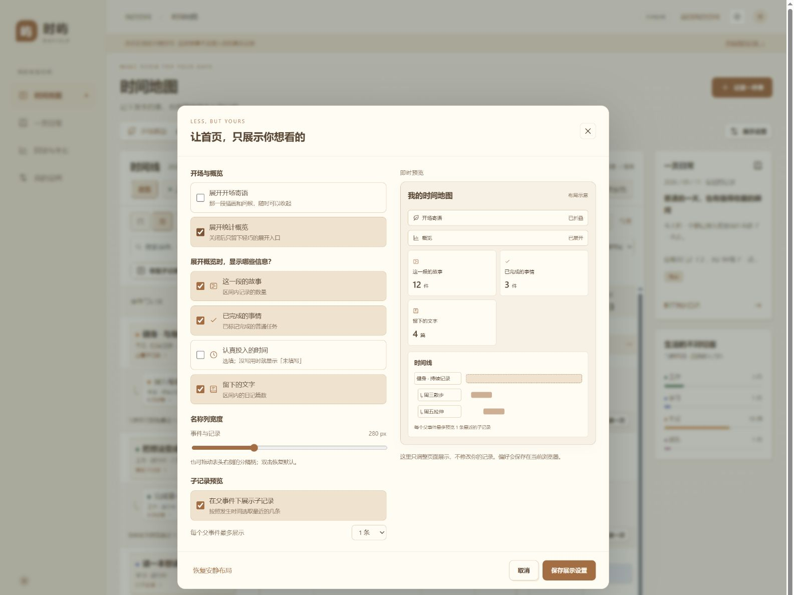

# 时屿 DayIsle

**把日子，慢慢写成自己喜欢的样子。**

一款本地运行的时间线与日记应用：记录今天做过什么，收藏长期喜欢的事，回顾工作、学习与生活里的小进展。

Python 标准库 · 无需安装依赖 · 四种主题 · JSONL 本地存储 · MIT 开源

*A local-first timeline and journal for everyday life. Nested events, gentle ongoing records, and Markdown reviews. No account, cloud service, or build step required.*



> 本页截图全部来自应用内置的虚构示例空间，不包含任何真实个人记录。

## 让记录有自己的节奏

- **一张时间地图**：日、周、月、季度、年和自定义范围；按真实时间跨度展示，支持分类、搜索与排序。
- **从大事到小进展**：事件可以逐层拆成子事件。点击名称框进入子时间线，点击时间条或铅笔编辑；首页可预览最近 1 / 3 / 5 / 10 / 20 条子记录。
- **持续记录**：健身、阅读、长期研究可以不设结束日期，不考核百分比。普通任务的进度与用时也可以留空。
- **安静的首页**：寄语、统计默认折叠。展示设置有排版预览，可选择显示哪些卡片；没填用时不会被显示成“0 小时”。
- **合适的列宽**：拖动表头右侧的分隔柄，调整名称列宽；双击还原。也可在展示设置里用滑块调整，浏览器会记住偏好。
- **日记与回顾**：记录心情、标签和事件关联；按周、月或自定区间整理回顾，导出 Markdown，用于生活复盘和工作报告。
- **数据握在自己手里**：JSONL 保存、完整 JSON 快照、CSV 导出与回收站。示例空间只读，与自己的记录分开。

## 三步开始

需要 **Python 3.11 或以上版本**。运行不需要 Node.js、npm、数据库或第三方 Python 包。

```bash
git clone https://github.com/AnandaFana/dayisle.git
cd dayisle
python run.py
```

macOS / Linux 如没有 `python` 命令，请使用 `python3 run.py`。Windows 也可以下载仓库 ZIP、解压后双击 **start.bat**。

浏览器会自动打开 [http://127.0.0.1:8765](http://127.0.0.1:8765)。保持启动窗口运行；按 `Ctrl+C` 停止服务。

1. 点击 **体验示例**，先逛逛虚构的生活空间。
2. 点击 **开始我的记录**，选择 **记录一件事**，从一句话开始。
3. 给长期的事添加子记录，或去 **一页日常** 写下今天。

```bash
# 自选端口，不自动打开浏览器
python run.py --port 8999 --no-browser

# 创建另一个独立空间；目录不存在时会自动创建
python run.py --port 8770 --data-dir ../another-space-data
```

一个数据目录只能由一个进程写入。要同时运行两个空间，请同时使用不同的端口和数据目录。

## 四种气质，同一份生活

在 **我的空间** 或顶部主题按钮切换：薄荷花园、纸上时光、霓虹漫游、素白留白。主题、折叠状态和列宽保存在当前浏览器。

| 纸上时光 · 温暖纸感 | 霓虹漫游 · 赛博朋克 |
| --- | --- |
|  |  |

<details>
<summary>看看可选择模块的展示设置</summary>



</details>

## 数据与隐私

已保存的记录位于 **data/records.jsonl**，每行是一笔带版本号的变更事务；日记也保存在这里。启动新空间不会写入示例事件。

- 应用仅监听本机回环地址，没有账号、遥测、外部 CDN 或云同步。运行时不依赖网络服务。
- **我的空间 → 数据握在自己手里** 可以下载 JSON 备份、导出事件与日记 CSV、合并导入备份。相同 ID 内容冲突时整次拒绝覆盖。
- JSON 快照含当前记录与回收站；需要完整修订历史时，停止服务后复制整个数据目录。
- 主题、展示偏好及未提交草稿存在浏览器 `localStorage`，不包含在 JSON 备份中。
- 文件与草稿以明文保存。JSONL 保留旧修订；回收站恢复不等于永久擦除功能。
- `.gitignore` 排除了数据目录、JSONL、CSV、备份与日志。自定义数据目录建议放在仓库外，提交代码前仍请检查暂存内容。

更多细节见 [时间、统计与数据约定](docs/USAGE.md)。

## 配置与开发

编辑 **config.toml** 调整默认端口、数据目录、默认主题与视图，以及 `[display]` 中的默认展示选项。分类种子只用于初始化新空间；已有分类在页面内编辑。

```text
dayisle/
├── run.py                  命令行入口
├── config.toml             运行配置、初始分类与展示默认值
├── dayisle/
│   ├── server.py           HTTP 路由和导入导出
│   ├── storage.py          JSONL 事务、独占锁与版本保护
│   ├── domain.py           字段、父子关系与恢复校验
│   ├── reports.py          Markdown 回顾
│   └── demo.py             虚构示例空间
├── static/
│   ├── themes.css          四套主题变量
│   ├── timeline.css        时间线与展示设置样式
│   └── js/                 页面、编辑器、列宽交互等独立模块
├── tests/                  Python 与 JavaScript 测试
└── docs/                   使用约定与示例截图
```

无前端构建步骤：修改 HTML / CSS / JS 后刷新浏览器；修改 Python / TOML 后重启服务。

```bash
python -m unittest discover -s tests -v
# 以下仅开发测试需要 Node.js 22+，运行应用不需要
node --test tests/test_dates.mjs tests/test_display.mjs tests/test_resize.mjs
```

欢迎提交改进，见 [贡献指南](CONTRIBUTING.md)。

## 当前边界

这是单用户本机应用，不提供账户、多设备同步、提醒、自动计时、附件或甘特条拖动改期。手机尺寸有布局适配，不表示支持远程访问本机服务。回顾是对已记录内容的确定性整理，不调用 AI 模型。万级记录规模尚未进行压力验证。

事件跨度不等于投入时间；父事件不会自动累计子事件的分钟数或进度。手填投入按结束日期归属，无结束日时按开始日期归属。跨周工作建议按天建子记录，便于周报统计。

## 许可证

[MIT](LICENSE) · 欢迎使用、修改与分享。愿每一个普通日子，都有地方安放。
